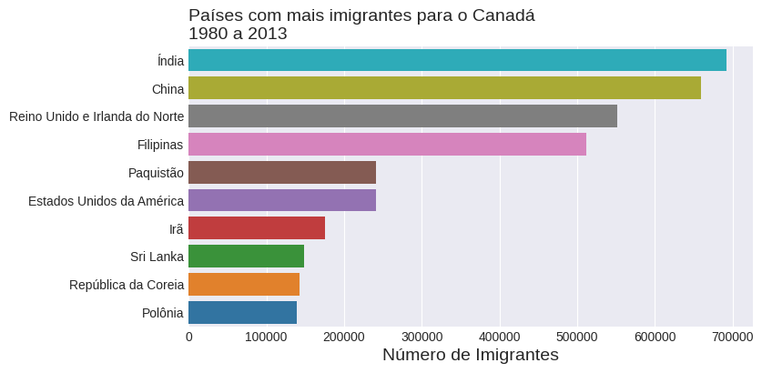
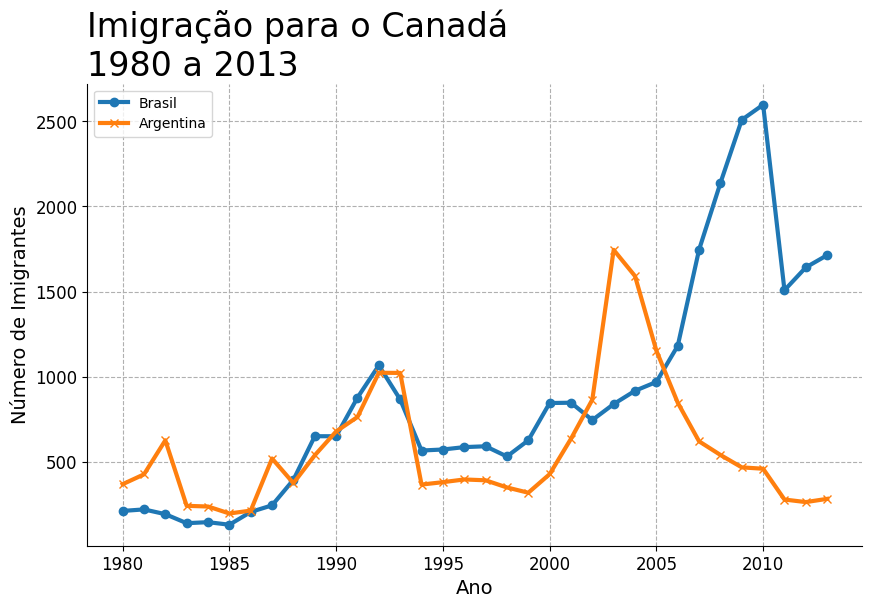
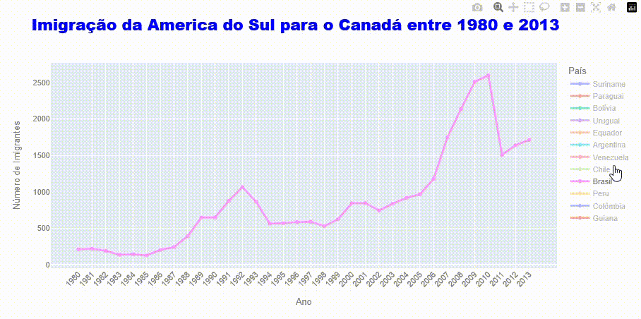
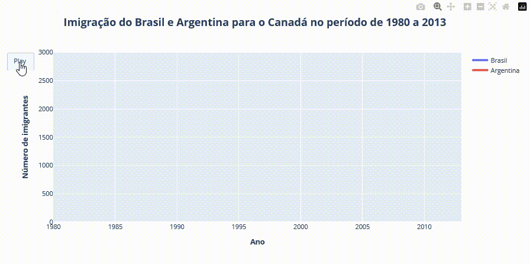

<h1> Exercícios: ONE Data Science - Análise da Imigração para o Canadá (1980-2013) </h1>

  
  
  
  
  
  
  
  

<h2>Resumo do projeto</h2>

Projeto realizado no curso ONE Data Science G8

Realizado na Alura, visando o desenvolvimento das habilidades em análise de dados e ETL com Python.

<h2>❔ Objetivo</h2>
# Análise da Imigração para o Canadá (1980-2013)

Este projeto realiza uma análise exploratória dos dados de imigração para o Canadá, abrangendo o período de 1980 a 2013. O conjunto de dados utilizado contém informações sobre imigrantes de mais de 150 países.

## Conjunto de Dados

O conjunto de dados utilizado neste projeto é o "Immigration to Canada" disponível no Kaggle:

- **Contexto:** O objetivo principal deste conjunto de dados é analisar as tendências e padrões ocultos dos imigrantes de todo o mundo para o Canadá.
- **Conteúdo:** Este conjunto de dados consiste em registros de imigrantes de mais de 150 países para o Canadá entre 1980 e 2013.
- **Link:** [https://www.kaggle.com/datasets/ammaraahmad/immigration-to-canada](https://www.kaggle.com/datasets/ammaraahmad/immigration-to-canada)

Os dados são carregados diretamente de um repositório GitHub para garantir a reprodutibilidade.

## Objetivo do Projeto

O principal objetivo deste projeto é visualizar e analisar as tendências de imigração para o Canadá ao longo do tempo, com foco especial na comparação entre países da América do Sul e na identificação dos países com maior número de imigrantes.

## Tecnologias Utilizadas

- Python
- Pandas
- Matplotlib
- Seaborn
- Plotly
- Streamlit

## Estrutura do Projeto

O projeto é apresentado como um notebook Jupyter (ou Google Colab), onde as etapas de análise e visualização são realizadas sequencialmente.

1.  **Carregamento e Exploração dos Dados:** Os dados são carregados a partir da URL fornecida e são realizadas verificações iniciais para entender a estrutura e o conteúdo do DataFrame.
2.  **Pré-processamento dos Dados:** A coluna 'País' é definida como índice para facilitar a seleção de dados por país. Uma lista de anos é criada para acesso dinâmico às colunas de anos.
3.  **Análise de Imigração por País:**
    - É feita uma análise detalhada da imigração do Brasil para o Canadá, com a criação de um DataFrame específico e um gráfico de linhas.
    - É realizada uma comparação entre a imigração do Brasil e da Argentina para o Canadá, utilizando diferentes abordagens para a criação dos DataFrames de comparação e gerando gráficos de linhas comparativos.
4.  **Criação de Figuras e Subplots com Matplotlib:** Exploração da criação de figuras e subplots para visualizar dados de vendas de diferentes lojas (este é um exemplo separado para demonstrar funcionalidades do Matplotlib).
5.  **Customização de Gráficos com Matplotlib:** Aplicação de customizações em gráficos de linhas, como alteração de espessura, marcadores, títulos, rótulos e estilos.
6.  **Criação de Gráficos com Seaborn:** Utilização do Seaborn para criar um gráfico de barras dos 10 países com maior número de imigrantes para o Canadá. Exploração de paletas de cores e estilos.
7.  **Visualização Interativa com Plotly:** Criação de gráficos de linha interativos com Plotly Express para visualizar as tendências de imigração do Brasil e de países da América do Sul.
8.  **Animação com Plotly Graph Objects:** Criação de gráficos de linha animados para mostrar a evolução da imigração do Brasil e da comparação Brasil x Argentina ao longo do tempo.
9.  **Salvando Gráficos:** Demonstração de como salvar gráficos em diferentes formatos (PNG e HTML).

## Como Executar o Projeto

1.  Clone este repositório para sua máquina local.
2.  Abra o notebook Jupyter (ou Google Colab).
3.  Execute as células sequencialmente para reproduzir a análise e as visualizações.

**Nota:** Certifique-se de ter as bibliotecas Python necessárias instaladas (pandas, numpy, matplotlib, seaborn, plotly). Se estiver usando Google Colab, a maioria dessas bibliotecas já estará disponível.

## Versão em Streamlit

- Uma versão dos principais gráficos foi realizada com o Streamlit e incluída no arquivo [Canada.py](./canada.py)

## Visualizações Chave

O projeto gera diversas visualizações para ilustrar as tendências de imigração, incluindo:

- Gráfico de barras dos países com maior imigração total para o Canadá.

- Gráfico de linha comparando a imigração do Brasil e da Argentina para o Canadá.

- Gráfico de barras mostrando os 10 países com maior número de imigrantes.

- Gráfico interativo mostrando as tendências de imigração de Países da América do Sul (utilizando Seaborn).

- Gráficos de linhas interativos e animados (utilizando Plotly).

## Contribuições

Contribuições são bem-vindas! Se você tiver sugestões ou melhorias, sinta-se à vontade para abrir um pull request.

<h2>✔️ Técnicas e tecnologias utilizadas</h2>

   - Para realizar a análise, foi utilizado o ambiente do Google Colab, com a linguagem Python e as bibliotecas Pandas, Matplotlib, Seaborn e Plotly.
   - Para a versão interativa foi utilizado o VSCode e o Streamlit.

<h2>📁 Acesso ao projeto</h2>

   - Você pode acessar o projeto no Colab clicando [aqui]([https://colab.research.google.com/drive/1k3vyfDDmRIAWYc_KENlaCZ_gmb3SYnS9?usp=sharing])

<h2> Autor </h2>

[  Mauricio Andre de Almeida](https://github.com/mauricioaalmeida) 
